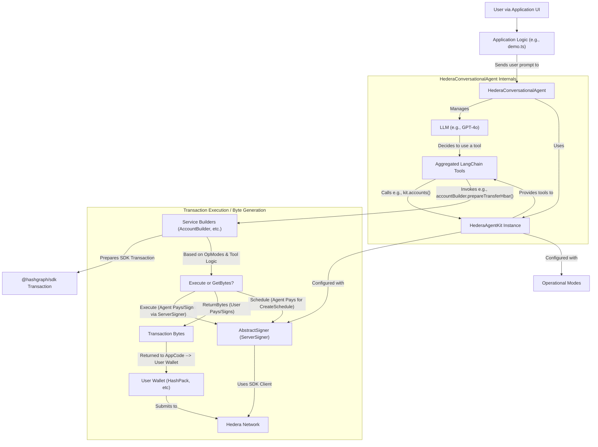

# hedera-agent-kit

Build LLM-powered applications that interact with the Hedera Network. Create conversational agents that can understand user requests in natural language and execute Hedera transactions, or build backend systems that leverage AI for on-chain operations.

## Key Features

- **Conversational Hedera**: Easily build chat-based interfaces for Hedera actions.
- **Flexible Transaction Handling**:
  - **Direct Execution**: For autonomous agents or backend control.
  - **Provide Bytes**: For user-centric apps where users sign with their own wallets (e.g., HashPack via WalletConnect).
  - **Scheduled Transactions**: Built-in support for "human-in-the-loop" workflows, where AI prepares transactions for user review and approval.
- **Comprehensive Toolset**: Pre-built tools for HTS, HCS, HBAR transfers, account management, files, and smart contracts.
- **Token Usage Tracking**: Real-time tracking of LLM token usage with accurate cost calculation based on dynamic pricing.
- **Extensible**: Add your own custom tools with the plugin system.
- **Simplified SDK Interaction**: Abstracts away much of the Hedera SDK boilerplate.

## Table of Contents

- [hedera-agent-kit](#hashgraph-onlinehedera-agent-kit)
  - [Key Features](#key-features)
  - [Table of Contents](#table-of-contents)
  - [Installation](#installation)
  - [Quick Start: Your First Conversational Hedera Agent](#quick-start-your-first-conversational-hedera-agent)
  - [Core Concepts](#core-concepts)
  - [Handling User Prompts](#handling-user-prompts)
    - [Processing User Prompts](#processing-user-prompts)
    - [Understanding Agent Responses](#understanding-agent-responses)
    - [Handling Different Response Types](#handling-different-response-types)
      - [1. Text-only Responses](#1-text-only-responses)
      - [2. Transaction Bytes (returnBytes mode)](#2-transaction-bytes-returnBytes-mode)
      - [3. Schedule IDs (scheduled transactions)](#3-schedule-ids-scheduled-transactions)
    - [Working with Chat History](#working-with-chat-history)
    - [Example: Complete Prompt Handling Flow](#example-complete-prompt-handling-flow)
      - [Scheduled Transaction Implementation](#scheduled-transaction-implementation)
  - [Available Tools](#available-tools)
    - [Account Management Tools](#account-management-tools)
    - [HBAR Transaction Tools](#hbar-transaction-tools)
    - [HTS Token Service Tools](#hts-token-service-tools)
    - [HCS Consensus Service Tools](#hcs-consensus-service-tools)
    - [File Service Tools](#file-service-tools)
    - [Smart Contract Service Tools](#smart-contract-service-tools)
  - [Advanced Usage](#advanced-usage)
    - [Using `HederaAgentKit` Directly](#using-hederaagentkit-directly)
    - [Tool Filtering](#tool-filtering)
    - [Token Usage Tracking and Cost Calculation](#token-usage-tracking-and-cost-calculation)
      - [Key Features:](#key-features-1)
      - [Response Structure:](#response-structure)
    - [Plugin System](#plugin-system)
  - [API Reference](#api-reference)
    - [HederaConversationalAgent Options](#hederaconversationalagent-options)
  - [Architecture Diagram](#architecture-diagram)
  - [Local Development](#local-development)
  - [Contributing](#contributing)
  - [License](#license)

## Installation

```bash
npm install hedera-agent-kit
# or
yarn add hedera-agent-kit
```

For frontend integration with WalletConnect:

```bash
npm install @hashgraph/hedera-wallet-connect
# or
yarn add @hashgraph/hedera-wallet-connect
```

_(Ensure you have `dotenv` for environment variable management if you use `.env` files.)_

## Quick Start: Your First Conversational Hedera Agent

This example demonstrates setting up the `HederaConversationalAgent` for a user-centric scenario where the user signs scheduled transactions. The agent's operator account will pay to create the schedule, and the user's account will be set to pay for the actual scheduled transaction when it's signed and submitted by the user.

**1. Set up your `.env` file:**

```env
OPENAI_API_KEY="sk-..."
HEDERA_ACCOUNT_ID="0.0.YOUR_AGENT_OPERATOR_ID"
HEDERA_PRIVATE_KEY="your_agent_operator_private_key"
HEDERA_NETWORK="testnet"
USER_ACCOUNT_ID="0.0.YOUR_USER_ACCOUNT_ID"
USER_PRIVATE_KEY="your_user_private_key"
```

**2. Run the interactive demo:**

```bash
npm install
npm run demo:langchain
```

**3. Example Interaction:**

```
User > Schedule a transfer of 0.1 HBAR from my account to 0.0.34567
Agent > Okay, I have scheduled a transfer of 0.1 HBAR from your account (0.0.USER_ACCOUNT_ID) to 0.0.34567. The Schedule ID is 0.0.xxxxxx.
Agent > Transaction bytes received. Do you want to sign and execute this with YOUR account 0.0.USER_ACCOUNT_ID? (y/n): y
Agent > Transaction executed with your key. Receipt: { ... }
```

**4. Demo Source Reference:**

The demo code is in `examples/langchain-demo.ts`. Here is a simplified excerpt:

```typescript
import * as dotenv from 'dotenv';
dotenv.config();
import { ServerSigner } from 'hedera-agent-kit';
import { HederaConversationalAgent } from 'hedera-agent-kit';

async function main() {
  const operatorId = process.env.HEDERA_ACCOUNT_ID;
  const operatorKey = process.env.HEDERA_PRIVATE_KEY;
  const network = process.env.HEDERA_NETWORK || 'testnet';
  const openaiApiKey = process.env.OPENAI_API_KEY;
  const userAccountId = process.env.USER_ACCOUNT_ID;
  const userPrivateKey = process.env.USER_PRIVATE_KEY;

  if (!operatorId || !operatorKey)
    throw new Error(
      'HEDERA_ACCOUNT_ID and HEDERA_PRIVATE_KEY must be set in .env'
    );

  const agentSigner = new ServerSigner(operatorId, operatorKey, network);
  const conversationalAgent = new HederaConversationalAgent(agentSigner, {
    operationalMode: 'returnBytes',
    userAccountId: userAccountId,
    verbose: false,
    openAIApiKey: openaiApiKey,
  });
  await conversationalAgent.initialize();
  // ... (see examples/langchain-demo.ts for full interactive loop)
}
main().catch(console.error);
```

## Core Concepts

Understanding these concepts will help you make the most of the Hedera Agent Kit:

- **`HederaConversationalAgent`**: The primary interface for building chat-based applications. It combines the power of an LLM with the Hedera-specific tools provided by `HederaAgentKit`.
- **`HederaAgentKit`**: The core engine that bundles tools, manages network clients, and holds the `signer` configuration. It's used internally by `HederaConversationalAgent` but can also be used directly for more programmatic control.
- **Signers (`AbstractSigner`)**: Determine how transactions are signed and paid for:
  - `ServerSigner`: Holds a private key directly. Useful for backend agents where the agent's account pays for transactions it executes.
- **Operational Modes**: Configure how the agent handles transactions:
  - `operationalMode: 'autonomous'`: Agent signs and submits all transactions using its `signer`. The agent's operator account pays.
  - `operationalMode: 'returnBytes'`: Agent returns transaction bytes. Your application (and the user, via their wallet) is responsible for signing and submitting. This is key for user-centric apps.
  - `scheduleUserTransactionsInBytesMode: boolean` (Default: `true`): When `operationalMode` is `'returnBytes'`, this flag makes the agent automatically schedule transactions initiated by the user (e.g., "transfer _my_ HBAR..."). The agent's operator account pays to _create the schedule entity_, and the user pays for the _actual scheduled transaction_ when they sign the `ScheduleSignTransaction`.
  - `metaOptions: { schedule: true }`: Allows the LLM to explicitly request scheduling for any tool call, overriding defaults.
- **Human-in-the-Loop Flow**: The Quick Start example demonstrates this. The agent first creates a schedule (agent pays). Then, after user confirmation, it prepares a `ScheduleSignTransaction` (user pays to sign and submit this, triggering the original scheduled transaction).

## Handling User Prompts

When building applications with `HederaConversationalAgent`, it's important to establish a proper flow for handling user prompts and agent responses. This section explains how to process user inputs, manage conversation history, and handle the various response types from the agent.

### Processing User Prompts

To send a user's message to the agent and receive a response:

```typescript
// Initialize the agent as shown in the Quick Start example
const conversationalAgent = new HederaConversationalAgent(agentSigner, {
  operationalMode: 'returnBytes',
  userAccountId: userAccountId,
  openAIApiKey: openaiApiKey,
});
await conversationalAgent.initialize();

// Create a chat history array to maintain conversation context
const chatHistory: Array<{ type: 'human' | 'ai'; content: string }> = [];

// Process a user message
async function handleUserMessage(userInput: string) {
  // Add the user's message to chat history
  chatHistory.push({ type: 'human', content: userInput });

  // Process the message using the agent
  const agentResponse = await conversationalAgent.processMessage(
    userInput,
    chatHistory
  );

  // Add the agent's response to chat history
  chatHistory.push({ type: 'ai', content: agentResponse.output });

  // Return the full response to handle any transaction data
  return agentResponse;
}
```

### Understanding Agent Responses

The `processMessage` method returns an `AgentResponse` object with these key properties:

```typescript
interface AgentResponse {
  output: string; // The text response to show to the user
  transactionBytes?: string; // Base64-encoded transaction bytes (when in 'returnBytes' mode)
  scheduleId?: ScheduleId; // The schedule ID when a transaction was scheduled
  error?: string; // Error message if something went wrong
}
```

### Handling Different Response Types

Depending on your operational mode, you'll need to handle different response types:

#### 1. Text-only Responses

Simple informational responses require no special handling:

```typescript
const response = await handleUserMessage("What's my HBAR balance?");
console.log(response.output); // Display to the user
```

#### 2. Transaction Bytes (returnBytes mode)

When the agent generates transaction bytes, you'll need to present them to the user for signing:

```typescript
const response = await handleUserMessage('Transfer 10 HBAR to 0.0.12345');

if (response.transactionBytes) {
  // Option 1: Using Hashinal WalletConnect SDK
  import { DAppConnector } from '@hashgraph/hedera-wallet-connect';
  import { Transaction } from '@hashgraph/sdk';

  const sdk = HashinalsWalletConnectSDK.getInstance();
  await sdk.init(projectId, metadata);
  await sdk.connect();

  // Sign and submit the transaction
  const txBytes = Buffer.from(response.transactionBytes, 'base64');
  const transaction = Transaction.fromBytes(txBytes);
  const receipt = await sdk.executeTransaction(transaction);
  console.log('Transaction executed:', receipt);

  // Option 2: If you have the user's key in your app
  const userSigner = new ServerSigner(userAccountId, userPrivateKey, network);
  const txBytes = Buffer.from(response.transactionBytes, 'base64');
  const transaction = Transaction.fromBytes(txBytes);
  const signedTx = await transaction.sign(userSigner.getOperatorPrivateKey());
  const txResponse = await signedTx.execute(userSigner.getClient());
}
```

#### 3. Schedule IDs (scheduled transactions)

When the agent creates a scheduled transaction:

```typescript
const response = await handleUserMessage(
  'Schedule a transfer of 5 HBAR from my account to 0.0.12345'
);

if (response.scheduleId) {
  const scheduleIdStr = response.scheduleId.toString();
  console.log(`Transaction scheduled with ID: ${scheduleIdStr}`);

  // Ask the user if they want to sign the scheduled transaction
  const userWantsToSign = await askUserForConfirmation();

  if (userWantsToSign) {
    // Ask the agent to prepare the ScheduleSign transaction
    const signResponse = await handleUserMessage(
      `Sign the scheduled transaction with ID ${scheduleIdStr}`
    );

    // Handle the resulting transaction bytes as shown above
    if (signResponse.transactionBytes) {
      // Present to wallet or sign with user key
    }
  }
}
```

### Working with Chat History

The chat history is crucial for giving the agent context of the conversation. Some best practices:

1. **Format**: Each entry should have a `type` ('human' or 'ai') and `content` (string).
2. **Memory Management**: Limit history length to avoid token limits:

```typescript
// Trim history if it gets too long
if (chatHistory.length > 20) {
  // Keep the most recent 15 messages
  chatHistory.splice(0, chatHistory.length - 15);
}
```

3. **Preserving Context**: For better results, make sure to include important context:

```typescript
// Special initialization message to set context
chatHistory.push({
  type: 'system',
  content: 'The user's account ID is 0.0.12345. They are interested in NFTs.'
});
```

### Example: Complete Prompt Handling Flow

Here's a complete example bringing all the concepts together:

```typescript
async function handleHederaConversation() {
  // Initialize agent
  const agent = new HederaConversationalAgent(agentSigner, {
    operationalMode: 'returnBytes',
    userAccountId: userAccountId,
    openAIApiKey: openaiApiKey,
  });
  await agent.initialize();

  const chatHistory = [];

  // Initialize with context
  chatHistory.push({
    type: 'system',
    content: `User account: ${userAccountId}. Network: ${network}.`,
  });

  // Simulated chat loop
  while (true) {
    const userInput = await getUserInput(); // Your UI input function
    if (userInput.toLowerCase() === 'exit') break;

    chatHistory.push({ type: 'human', content: userInput });

    const response = await agent.processMessage(userInput, chatHistory);
    displayToUser(response.output);
    chatHistory.push({ type: 'ai', content: response.output });

    // Handle special responses
    if (response.transactionBytes) {
      const shouldSign = await askUserToSign();
      if (shouldSign) {
        await signAndSubmitTransaction(response.transactionBytes);
      }
    }

    if (response.scheduleId) {
      displayToUser(
        `Transaction scheduled! ID: ${response.scheduleId.toString()}`
      );
      // Handle schedule signing if needed
    }

    // Trim history if needed
    if (chatHistory.length > 20) chatHistory.splice(0, chatHistory.length - 15);
  }
}
```

#### Scheduled Transaction Implementation

When working with scheduled transactions, you can check their status and handle approvals programmatically:

```typescript
import { DAppConnector } from '@hashgraph/hedera-wallet-connect';
import { ScheduleSignTransaction } from '@hashgraph/sdk';
import { HederaMirrorNode } from '../src/services/mirror-node';
import { TransactionParser } from '../src/utils/transaction-parser';

async function handleScheduledTransaction(
  scheduleId: string,
  network: 'mainnet' | 'testnet'
) {
  // Initialize WalletConnect SDK
  const sdk = HashinalsWalletConnectSDK.getInstance();
  await sdk.init(projectId, metadata);
  await sdk.connect();

  // Create mirror node instance
  const mirrorNode = new HederaMirrorNode(network);

  // Fetch schedule information
  const scheduleInfo = await mirrorNode.getScheduleInfo(scheduleId);

  if (!scheduleInfo) {
    throw new Error('Schedule not found');
  }

  // Check if already executed
  if (scheduleInfo.executed_timestamp) {
    console.log(
      'Transaction already executed at:',
      scheduleInfo.executed_timestamp
    );
    return { status: 'executed', timestamp: scheduleInfo.executed_timestamp };
  }

  // Parse transaction details
  const transactionDetails = TransactionParser.parseScheduleResponse({
    transaction_body: scheduleInfo.transaction_body,
    memo: scheduleInfo.memo,
  });

  console.log('Transaction Details:', {
    type: transactionDetails.humanReadableType,
    transfers: transactionDetails.transfers,
    memo: transactionDetails.memo,
    expirationTime: scheduleInfo.expiration_time,
  });

  // Create and execute the ScheduleSign transaction
  const scheduleSignTx = new ScheduleSignTransaction().setScheduleId(
    scheduleId
  );

  try {
    // For scheduled transactions, disable signer since it's already configured
    const receipt = await sdk.executeTransaction(scheduleSignTx, false);
    console.log('Schedule signed successfully:', receipt);
    return { status: 'signed', receipt };
  } catch (error) {
    console.error('Failed to sign schedule:', error);
    throw error;
  }
}

// Usage with HederaConversationalAgent
async function exampleScheduledTransactionFlow() {
  const agent = new HederaConversationalAgent(agentSigner, {
    operationalMode: 'returnBytes',
    userAccountId: userAccountId,
    scheduleUserTransactionsInBytesMode: true, // Auto-schedule user transactions
  });

  // User requests a scheduled transaction
  const response = await agent.processMessage(
    'Schedule a transfer of 10 HBAR from my account to 0.0.12345 for tomorrow'
  );

  if (response.scheduleId) {
    console.log(
      'Transaction scheduled with ID:',
      response.scheduleId.toString()
    );

    // Handle the scheduled transaction approval
    const result = await handleScheduledTransaction(
      response.scheduleId.toString(),
      'testnet'
    );

    console.log('Schedule handling result:', result);
  }
}

// Polling example - check schedule status periodically
async function pollScheduleStatus(
  scheduleId: string,
  network: 'mainnet' | 'testnet'
) {
  const mirrorNode = new HederaMirrorNode(network);

  const checkStatus = async () => {
    const scheduleInfo = await mirrorNode.getScheduleInfo(scheduleId);

    if (scheduleInfo?.executed_timestamp) {
      console.log('Schedule executed!');
      clearInterval(intervalId);

      // Get the executed transaction details
      const executedTx = await mirrorNode.getTransactionByTimestamp(
        scheduleInfo.executed_timestamp
      );
      console.log('Executed transaction:', executedTx);
    } else if (scheduleInfo?.deleted_timestamp) {
      console.log('Schedule was deleted');
      clearInterval(intervalId);
    } else {
      console.log('Schedule still pending...');
    }
  };

  // Check immediately and then every 5 seconds
  await checkStatus();
  const intervalId = setInterval(checkStatus, 5000);

  // Return cleanup function
  return () => clearInterval(intervalId);
}
```

## Available Tools

The Hedera Agent Kit provides a comprehensive set of tools organized by service type. These tools can be used both by the conversational agent and programmatically.

### Account Management Tools

| Tool Name                                       | Description                                        | Example Usage                                             |
| ----------------------------------------------- | -------------------------------------------------- | --------------------------------------------------------- |
| `hedera-account-create`                         | Creates a new Hedera account                       | Create an account with initial balance and key            |
| `hedera-account-update`                         | Updates properties of an existing account          | Change account memo, auto-renew period, etc.              |
| `hedera-account-delete`                         | Deletes an account and transfers remaining balance | Delete an account and transfer funds to another account   |
| `hedera-transfer-hbar`                          | Transfers HBAR between accounts                    | Send HBAR from one account to another                     |
| `hedera-approve-hbar-allowance`                 | Approves an HBAR allowance for a spender account   | Grant permission for another account to spend your HBAR   |
| `hedera-approve-fungible-token-allowance`       | Approves a fungible token allowance                | Grant permission for another account to spend your tokens |
| `hedera-approve-token-nft-allowance`            | Approves an NFT allowance                          | Grant permission for another account to spend your NFTs   |
| `hedera-revoke-hbar-allowance`                  | Revokes an HBAR allowance                          | Remove permission for an account to spend your HBAR       |
| `hedera-revoke-fungible-token-allowance`        | Revokes a fungible token allowance                 | Remove permission for an account to spend your tokens     |
| `hedera-sign-and-execute-scheduled-transaction` | Signs and executes a scheduled transaction         | User signs a transaction prepared by the agent            |

### HBAR Transaction Tools

| Tool Name                      | Description                           | Example Usage                                       |
| ------------------------------ | ------------------------------------- | --------------------------------------------------- |
| `hedera-account-transfer-hbar` | Transfers HBAR between accounts       | Send HBAR with memo support and detailed parameters |
| `hedera-account-balance-hbar`  | Retrieves HBAR balance for an account | Check your HBAR balance                             |

### HTS Token Service Tools

| Tool Name                              | Description                                 | Example Usage                                           |
| -------------------------------------- | ------------------------------------------- | ------------------------------------------------------- |
| `hedera-hts-create-fungible-token`     | Creates a new fungible token                | Create a custom token with name, symbol, decimals, etc. |
| `hedera-hts-create-nft`                | Creates a new NFT collection                | Create an NFT collection with configurable properties   |
| `hedera-hts-mint-fungible-token`       | Mints additional supply of a fungible token | Add more tokens to circulation                          |
| `hedera-hts-mint-nft`                  | Mints a new NFT within a collection         | Create a new NFT with metadata                          |
| `hedera-hts-transfer-tokens`           | Transfers fungible tokens between accounts  | Send tokens from one account to another                 |
| `hedera-hts-transfer-nft`              | Transfers NFT ownership                     | Send an NFT to another account                          |
| `hedera-hts-associate-token`           | Associates a token to an account            | Enable an account to receive a token                    |
| `hedera-hts-dissociate-tokens`         | Removes token associations                  | Remove a token from your account                        |
| `hedera-hts-reject-tokens`             | Rejects automatically associated tokens     | Reject tokens you don't want                            |
| `hedera-hts-burn-fungible-token`       | Burns fungible tokens (reduces supply)      | Remove tokens from circulation                          |
| `hedera-hts-burn-nft`                  | Burns an NFT (destroys it)                  | Destroy an NFT permanently                              |
| `hedera-hts-update-token`              | Updates token properties                    | Modify token name, symbol, or other properties          |
| `hedera-hts-delete-token`              | Deletes a token                             | Remove a token completely                               |
| `hedera-hts-pause-token`               | Pauses a token (prevents transfers)         | Temporarily freeze all transfers of a token             |
| `hedera-hts-unpause-token`             | Unpauses a token                            | Resume transfers for a paused token                     |
| `hedera-hts-freeze-token-account`      | Freezes a token for a specific account      | Prevent an account from transferring a specific token   |
| `hedera-hts-unfreeze-token-account`    | Unfreezes a token for an account            | Allow transfers for a previously frozen account         |
| `hedera-hts-grant-kyc-token`           | Grants KYC for a token to an account        | Approve KYC for an account to use a token               |
| `hedera-hts-revoke-kyc-token`          | Revokes KYC for a token from an account     | Remove KYC approval for an account                      |
| `hedera-hts-wipe-token-account`        | Wipes tokens from an account                | Remove tokens from an account                           |
| `hedera-hts-token-fee-schedule-update` | Updates token fee schedule                  | Modify fees for a token                                 |
| `hedera-airdrop-token`                 | Airdrops tokens to multiple recipients      | Send tokens to many accounts at once                    |
| `hedera-claim-airdrop`                 | Claims an airdrop                           | Claim tokens sent to you                                |

### HCS Consensus Service Tools

| Tool Name                     | Description                    | Example Usage                           |
| ----------------------------- | ------------------------------ | --------------------------------------- |
| `hedera-create-topic`         | Creates a new HCS topic        | Create a topic for message consensus    |
| `hedera-delete-topic`         | Deletes an HCS topic           | Remove a topic you created              |
| `hedera-submit-topic-message` | Submits a message to a topic   | Send a message to be recorded on Hedera |
| `hedera-get-topic-messages`   | Gets messages from a topic     | Retrieve messages from a topic          |
| `hedera-get-topic-info`       | Gets information about a topic | Retrieve topic details                  |

### File Service Tools

| Tool Name            | Description                         | Example Usage                  |
| -------------------- | ----------------------------------- | ------------------------------ |
| `hedera-create-file` | Creates a new file on Hedera        | Store immutable data on Hedera |
| `hedera-append-file` | Appends content to an existing file | Add more data to a file        |
| `hedera-update-file` | Updates a file's contents           | Replace file contents          |
| `hedera-delete-file` | Deletes a file                      | Remove a file                  |

### Smart Contract Service Tools

| Tool Name                 | Description                  | Example Usage                            |
| ------------------------- | ---------------------------- | ---------------------------------------- |
| `hedera-create-contract`  | Deploys a smart contract     | Deploy Solidity contract bytecode        |
| `hedera-update-contract`  | Updates a contract           | Update contract properties               |
| `hedera-delete-contract`  | Deletes a contract           | Remove a deployed contract               |
| `hedera-execute-contract` | Executes a contract function | Call functions on your deployed contract |

## Advanced Usage

### Using `HederaAgentKit` Directly

For more programmatic control, you can use `HederaAgentKit` directly instead of the conversational agent:

```typescript
import { HederaAgentKit, ServerSigner } from 'hedera-agent-kit';
import { Hbar } from '@hashgraph/sdk';

async function useKitDirectly() {
  const signer = new ServerSigner(
    process.env.HEDERA_ACCOUNT_ID!,
    process.env.HEDERA_PRIVATE_KEY!,
    'testnet'
  );
  const kit = new HederaAgentKit(signer, undefined, 'autonomous');
  await kit.initialize();

  // Transfer HBAR
  const transferResult = await kit
    .accounts()
    .transferHbar({
      transfers: [
        { accountId: '0.0.RECIPIENT', amount: new Hbar(1) },
        { accountId: signer.getAccountId().toString(), amount: new Hbar(-1) },
      ],
      memo: 'Direct kit HBAR transfer',
    })
    .execute();
  console.log('Transfer result:', transferResult);

  // Create a token
  const createTokenResult = await kit
    .hts()
    .createFungibleToken({
      name: 'My Token',
      symbol: 'TKN',
      decimals: 2,
      initialSupply: 1000,
      maxSupply: 10000,
      memo: 'My first token',
    })
    .execute();
  console.log('Token created:', createTokenResult);
}
```

### Tool Filtering

You can control which tools are available to the conversational agent by providing a `toolFilter` function. This is useful when you want to:

- Limit the agent's capabilities for security reasons
- Create specialized agents focused on specific tasks
- Implement role-based access control
- Reduce the token count sent to the LLM by filtering out unnecessary tools

```typescript
import { HederaConversationalAgent } from 'hedera-agent-kit';
import { StructuredTool } from '@langchain/core/tools';

// Example 1: Allow only read operations (no state changes)
const readOnlyAgent = new HederaConversationalAgent(agentSigner, {
  openAIApiKey: process.env.OPENAI_API_KEY,
  toolFilter: (tool: StructuredTool) => {
    const readOnlyTools = [
      'get-',
      'query',
      'account-balance',
      'account-info',
      'topic-info',
      'token-info',
    ];
    return readOnlyTools.some((pattern) => tool.name.includes(pattern));
  },
});

// Example 2: Disable specific high-risk operations
const restrictedAgent = new HederaConversationalAgent(agentSigner, {
  openAIApiKey: process.env.OPENAI_API_KEY,
  toolFilter: (tool: StructuredTool) => {
    const blockedTools = [
      'hedera-account-delete',
      'hedera-hts-wipe-token-account',
      'hedera-hts-burn-nft',
      'hedera-delete-contract',
    ];
    return !blockedTools.includes(tool.name);
  },
});

// Example 3: Create an NFT-focused agent
const nftAgent = new HederaConversationalAgent(agentSigner, {
  openAIApiKey: process.env.OPENAI_API_KEY,
  userAccountId: userAccountId,
  toolFilter: (tool: StructuredTool) => {
    const nftTools = [
      'hedera-hts-create-nft',
      'hedera-hts-mint-nft',
      'hedera-hts-transfer-nft',
      'hedera-hts-burn-nft',
      'hedera-hts-associate-token',
      'hedera-account-get-nfts',
      'hedera-account-transfer-hbar', // For paying fees
      'hedera-account-get-balance',
    ];
    return nftTools.includes(tool.name);
  },
});

// Example 4: Dynamic filtering based on user roles
async function createRoleBasedAgent(userRole: 'admin' | 'user' | 'viewer') {
  const agent = new HederaConversationalAgent(agentSigner, {
    openAIApiKey: process.env.OPENAI_API_KEY,
    toolFilter: (tool: StructuredTool) => {
      switch (userRole) {
        case 'viewer':
          // Only allow read operations
          return tool.name.includes('get-') || tool.name.includes('query');
        case 'user':
          // Allow most operations except account management
          return (
            !tool.name.includes('account-delete') &&
            !tool.name.includes('account-create')
          );
        case 'admin':
          // Allow all tools
          return true;
        default:
          return false;
      }
    },
  });

  await agent.initialize();
  return agent;
}
```

### Token Usage Tracking and Cost Calculation

The Hedera Agent Kit now includes comprehensive token usage tracking and cost calculation for OpenAI API calls. This feature enables:

- Accurate billing based on actual LLM token consumption
- Real-time cost monitoring
- Usage history tracking
- Dynamic pricing from OpenRouter API (300+ models)

```typescript
import { HederaConversationalAgent, formatCost } from 'hedera-agent-kit';

// Initialize agent with token tracking
const agent = new HederaConversationalAgent(signer, {
  openAIApiKey: process.env.OPENAI_API_KEY,
  operationalMode: 'returnBytes',
});

await agent.initialize();

// Process a message - token usage is automatically tracked
const response = await agent.processMessage(
  'Create a new token called TestToken'
);

// Access token usage for this request
if (response.tokenUsage && response.cost) {
  console.log(`Tokens used: ${response.tokenUsage.totalTokens}`);
  console.log(`Cost: ${formatCost(response.cost)}`);
  console.log(`  - Prompt tokens: ${response.tokenUsage.promptTokens}`);
  console.log(`  - Completion tokens: ${response.tokenUsage.completionTokens}`);
}

// Get cumulative usage across all requests
const totalUsage = agent.getTotalTokenUsage();
console.log(`Total tokens used: ${totalUsage.totalTokens}`);
console.log(`Total cost: ${formatCost(totalUsage.cost)}`);

// Get detailed usage history
const history = agent.getTokenUsageHistory();
history.forEach((usage, index) => {
  console.log(
    `Request ${index + 1}: ${usage.totalTokens} tokens, ${formatCost(
      usage.cost
    )}`
  );
});

// Integration with credits/billing systems
const costUSD = response.cost?.totalCost || 0;
const hbarPrice = 0.05; // Get current HBAR price
const hbarEquivalent = costUSD / hbarPrice;
const creditsToDeduct = Math.ceil(hbarEquivalent * 1000); // 1 credit = 0.001 HBAR

console.log(`Credits to deduct: ${creditsToDeduct}`);

// Reset tracking for new billing session
agent.resetTokenUsageTracking();
```

#### Key Features:

- **Automatic Tracking**: Token usage is tracked automatically for every API call
- **Dynamic Pricing**: Fetches live pricing data from OpenRouter API with 24-hour caching
- **Cost Breakdown**: Separate costs for prompt and completion tokens
- **Session Management**: Reset tracking for new billing periods
- **Model Support**: Supports all OpenAI models plus 300+ models from OpenRouter

#### Response Structure:

```typescript
interface AgentResponse {
  output: string;
  tokenUsage?: {
    promptTokens: number;
    completionTokens: number;
    totalTokens: number;
    modelName?: string;
    timestamp?: Date;
  };
  cost?: {
    promptCost: number;
    completionCost: number;
    totalCost: number;
    currency: string; // 'USD'
  };
  // ... other fields
}
```

### Plugin System

Extend the agent's capabilities with custom plugins:

```typescript
import { HederaAgentKit, ServerSigner } from 'hedera-agent-kit';

async function useCustomPlugin() {
  const signer = new ServerSigner(
    process.env.HEDERA_ACCOUNT_ID!,
    process.env.HEDERA_PRIVATE_KEY!,
    'testnet'
  );

  // Create the kit with plugin configuration
  const kit = new HederaAgentKit(
    signer,
    {
      directories: ['./plugins'], // Local plugin directory
      packages: ['@my-org/my-hedera-plugin'], // NPM package plugin
      appConfig: { customSetting: 'value' }, // Custom config passed to plugins
    },
    'autonomous'
  );

  await kit.initialize();

  // Now the kit has all your plugin tools available
  const tools = kit.getAggregatedLangChainTools();
  console.log(
    'Available tools including plugins:',
    tools.map((t) => t.name)
  );
}
```

## API Reference

### HederaConversationalAgent Options

```typescript
interface HederaConversationalAgentOptions {
  // LLM Configuration
  llm?: BaseChatModel; // Provide your own LLM instance
  openAIApiKey?: string; // Or provide just the API key

  // Agent Configuration
  userAccountId?: string; // User's account ID for user-centric operations
  operationalMode?: AgentOperationalMode; // 'autonomous' or 'returnBytes'
  scheduleUserTransactionsInBytesMode?: boolean; // Auto-schedule user transactions

  // Plugin Configuration
  pluginConfig?: PluginConfig; // Configure plugins

  // Tool Filtering
  toolFilter?: (tool: StructuredTool) => boolean; // Filter which tools are available to the agent

  // Debug Options
  verbose?: boolean; // Enable verbose logging
  disableLogging?: boolean; // Disable all logging output
}
```

## Architecture Diagram



## Local Development

1. **Clone** the repo:

```bash
git clone https://github.com/hedera-dev/hedera-agent-kit.git
```

2. Install dependencies:

```bash
cd hedera-agent-kit
npm install
```

3. Configure environment variables (e.g., `OPENAI_API_KEY`, `HEDERA_ACCOUNT_ID`, `HEDERA_PRIVATE_KEY`) in a `.env` file based on the `sample.env` template.

4. Test the kit:

```bash
npm run test
```

5. Run the demo:

```bash
npm run demo:auto
```

## Contributing

We welcome contributions! Please see our [CONTRIBUTING.md](https://github.com/hedera-dev/hedera-agent-kit/blob/main/CONTRIBUTING.md) for details on our process, how to get started, and how to sign your commits under the DCO.

## License

Apache 2.0
